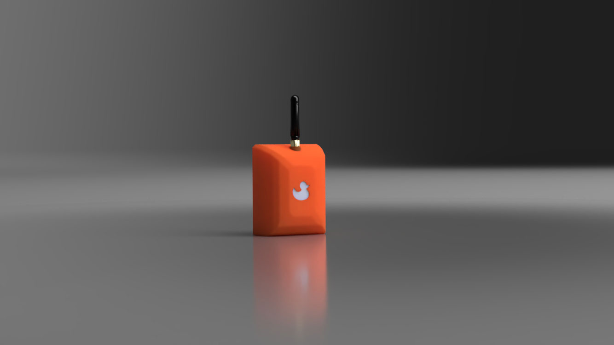

# PortaDuck - Simple Duck Case
This folder includs two files to 3D print an enclosure for a Heltec ESP32 v2 and a battery holder for three AA batteries.

Heltec Wifi Lora ESP32: https://heltec.org/project/wifi-lora-32/
* Check Local Rules and regulations for frequency. Can be bought from different sellers. 

Battery Case: https://tinyurl.com/qsep8ru

JST 1.25mm 2pin connector Male: https://tinyurl.com/wfjj4bq

